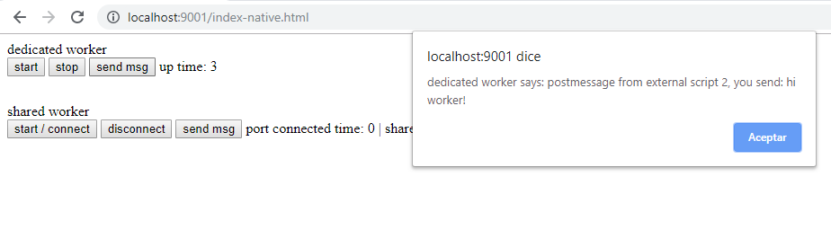
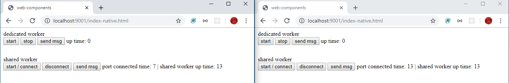

# Web workers
We can configure two types of web workers:

## Dedicated
It has an unique worker instance and connection that we can close.
In this example we can start and stop de worker, send and receive data and see the connection time.

## Shared
It has a worker instance and all the connections that you need. Each connection uses a port to enable a communication way with the worker for send or receive data.
The worker starts when the first connection is established and continues running even if all connections are closed.
In this example when we start the worker and establish a connection we will see how long we are connected and how long is the worker up.
If we open a new browser tab we will see the same worker up time.

